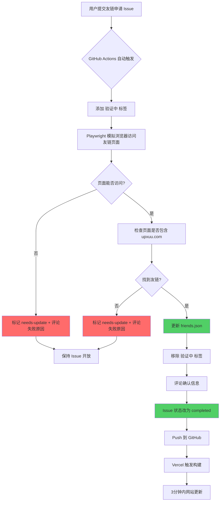

博客的友链申请系统全新上线啦！现在申请友链完全自动化，只需要填写一个表单，系统就会自动完成验证和添加。

## 使用方法

### 第一步：准备友链信息

在你网站的友链页面添加 UpXuu 的友链：

```yaml
名称: UpXuu
链接: https://upxuu.com
头像: https://upxuu.com/images/me.webp
描述: 逐光而上
```

### 第二步：提交申请

点击友链页面右上角的「新建友链申请」按钮，或直接访问 [GitHub Issues](https://github.com/ImUpXuu/myblog/issues/new?template=friend-request.yml) 填写申请表单。

需要填写的信息：

- **网站名称**：你的网站名字
- **网站链接**：你的网站首页
- **友链页面 URL**：你网站上添加了本站友链的页面地址（必填）
- **网站描述**：简短介绍一下你的网站

### 第三步：等待验证

提交后，系统会自动检查：

1. 你的友链页面是否可以正常访问
2. 页面中是否包含 UpXuu 的友链

验证通过后会自动关闭 Issue，友链直接生效。

### 验证失败怎么办

如果验证失败，Issue 会回复具体原因并标记 `needs-update` 标签。你修复问题后，只需在 Issue 下任意回复一条评论，系统就会重新验证。

## 技术原理

### 整体流程图



### 架构说明

原架构简图：

```
用户提交 Issue → GitHub Actions → Playwright 验证 → 自动部署 → Vercel 构建
```

### 关键技术点

#### 1. Issue 表单驱动

使用 GitHub Issue Templates 定义表单结构，用户提交的信息会自动填充到 Issue body 中。Workflow 监听 `issues` 事件获取表单数据。

#### 2. Playwright 浏览器自动化

使用 Playwright 模拟真实浏览器访问，可以绕过 Cloudflare 等反爬机制，同时检查页面内容和所有链接。配置了 12 秒超时和 3 次重试，提高稳定性。

#### 3. GitHub Actions 自动部署

验证通过后，Action 会自动：

- Stash 本地更改
- Pull 远程最新代码
- 添加友链到 `public/data/friends.json`（包含 issue_id）
- Commit 并 Push
- 触发 Vercel 重新构建部署

#### 4. 友链与 Issue 关联

每条通过 Issues 添加的友链都会记录对应的 issue_id，每日巡检发现异常时会自动在该 Issue 下评论通知，并标记「友链异常」标签。

### 标签系统

| 标签 | 用途 | 添加时机 |
|------|------|----------|
| `needs-update` | 验证失败需要用户处理 | 连通性失败或未找到友链 |
| `completed` | 验证通过已完成 | 整个流程结束（Issue 状态） |

### Issue 与友链的关联

每条友链在 `friends.json` 中都记录了对应的 `issue_id`：

```json
{
  "name": "xxx",
  "url": "https://xxx.com",
  "avatar": "https://xxx.com/avatar.webp",
  "description": "描述",
  "issue_id": 123
}
```

这样每日巡检发现异常时，可以精准找到对应的 Issue 进行通知。

### 相关文件

- [friend-link-checker.yml](https://github.com/ImUpXuu/myblog/blob/main/.github/workflows/friend-link-checker.yml) - 友链申请自动化工作流
- [cron-check.yml](https://github.com/ImUpXuu/myblog/blob/main/.github/workflows/cron-check.yml) - 每日巡检工作流
- [friend-request.yml](https://github.com/ImUpXuu/myblog/blob/main/.github/ISSUE_TEMPLATE/friend-request.yml) - 申请表单模板
- [friends.json](https://github.com/ImUpXuu/myblog/blob/main/public/data/friends.json) - 友链数据存储

## 每日巡检

每天 16:00 (UTC+8) 会自动检查所有友链的连通性。如果发现异常：
- 对于通过 Issues 添加的友链，会在该 Issue 下评论通知并添加 `needs-update` 标签
- 所有巡检结果汇总到巡检报告 Issue 中

---

有什么问题可以在 [GitHub Issues](https://github.com/ImUpXuu/myblog/issues) 里提，也可以直接评论哦~
